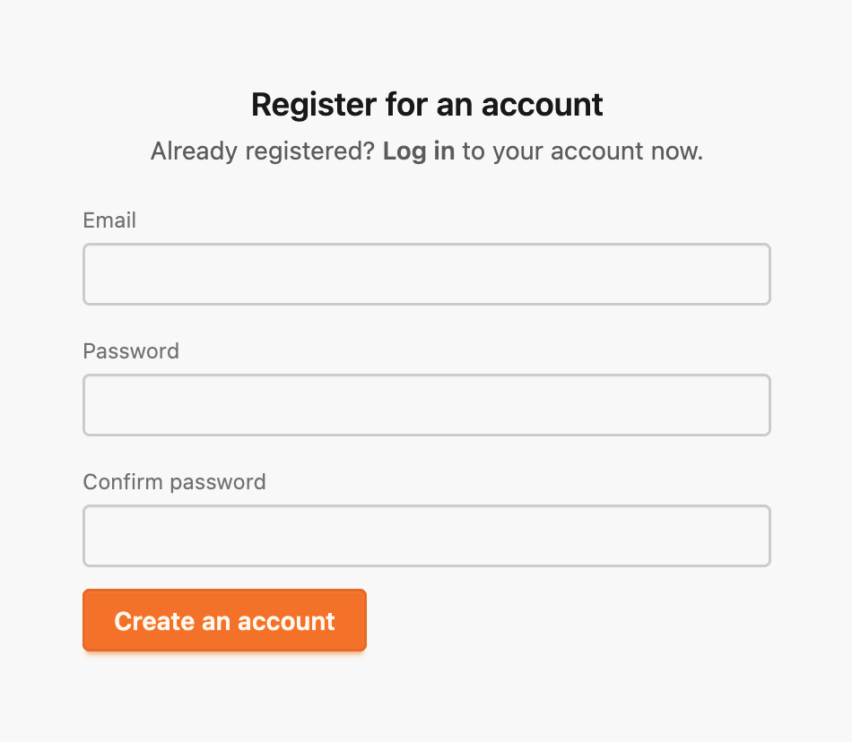

# User Registration and Authentication

(Maybe move this into the Accounts module docs in time?)

The Dustoff application requires authenticated users for most actions. In fact at this experimental stage verifying authentication flows and newer [Scope](https://hexdocs.pm/phoenix/1.8.0-rc.3/scopes.html) usage inside Phoenix is a primary project goal.

## Using `mix.gen.auth` as a starting point.

The Phoenix project provides generator tools to add user authentication to a standard Phoenix project template under the `mix` task `mix phx.gen.auth`. This is a particular good resource since it is mindful about security concerns and has been vetted by the wider community. However, with version 1.8 the task was changes to provide authentication through magic links and personally, I'd much rather see this site use a simple email/password registration screen. 

I decided to use the mix tasks as a starting point and have adjusted the generated code, removing the magic links and adding password to the registration form.

## Registration

Previously this form asked for just `email` and I expanded the form to ask for `password` and `password_confirmation`.

To manage the data of this form I made a new changeset function in `Dustoff.Accounts.User.registration_changeset/2`.

Upon submitting a valid form `Dustoff.Accounts.User` entity is created.

## Email Verification

In order to reduce friction, we allow users to register their account and immediately start using the app. We do not require them to verify they own the email identity they are providing, though that is a feature of the authentication system. In the future we may gatekeep some features to only be available to accounts with a verified email.

Additionally, we will built out the Change Email feature to exclusively use verified emailed links.

## Authentication

When a successful registration form is accepted, and after the `Dustoff.Accounts.User` entity is created, this use is authenticated using `DustoffWeb.UserAuth.log_in_user/3`.

Authentication involves two elements.

First a string-value `token` is generated (see `Dustoff.Accounts.UserToken.build_session_token/1`) and then using that a formal `Dustoff.Accounts.UserToken` entity is created using that `token` string-value as its identity.

The reason we are persisting `UserToken` entities is documented inside of `build_session_token/1` with:

> The reason why we store session tokens in the database, even though Phoenix
> already provides a session cookie, is because Phoenix' default session cookies
> are not persisted, they are simply signed and potentially encrypted. This
> means they are valid indefinitely, unless you change the signing/encryption
> salt.
> 
> Therefore, storing them allows individual user sessions to be expired. The
> token system can also be extended to store additional data, such as the device
> used for logging in. You could then use this information to display all valid
> sessions and devices in the UI and allow users to explicitly expire any
> session they deem invalid.

In addition to session tracking these `UserToken` entities are also used to accomplish some of the email link actions. It was used for magic links to log in (which I removed) -- but I will still support email account verification and change email (with a verification link).

 eventually stored in the session under the key `:user_token`. This is the token identity and 

First a and persisted in the database

(consider adding a mermaid diagram)

While initialized on the Phoenix [`mix phx.gen.auth`](https://hexdocs.pm/phoenix/1.8.0-rc.3/mix_phx_gen_auth.html) generators this app prefers single email/password flow when it comes to user account registration.

## Change Email

A user can register a new account without immediatly verifing their email and continue to use the site.

(We should add a verify button.)

For security we did however stick to a flow where in if they want to change their email, they need to do so through an email link, and doing that help us reuse logic that once such a token is accepted we will delete the previously persisted `UserToken` entities based on the old email.
